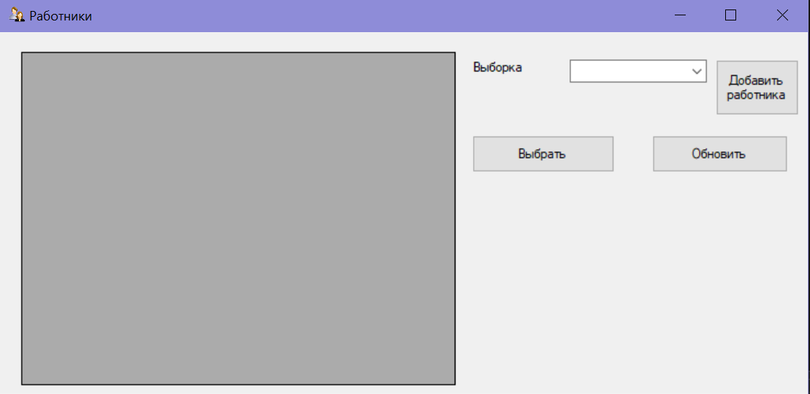
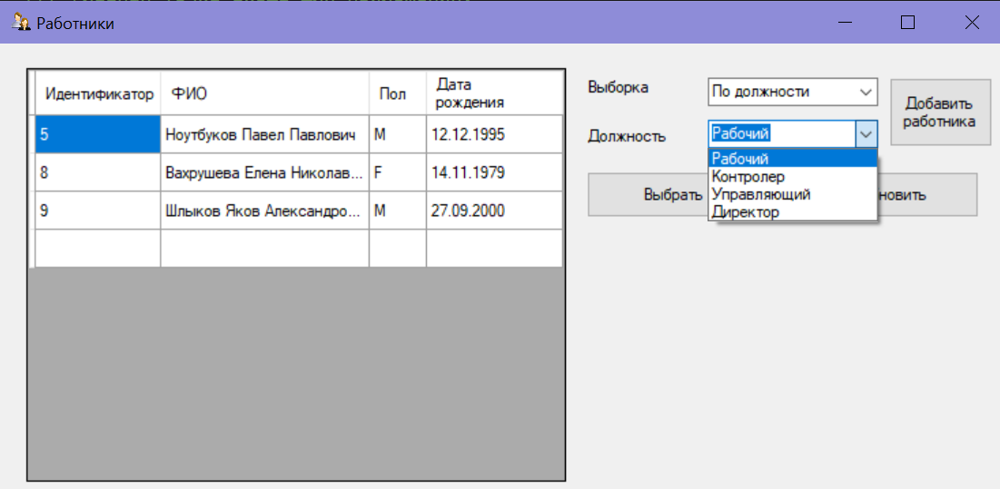
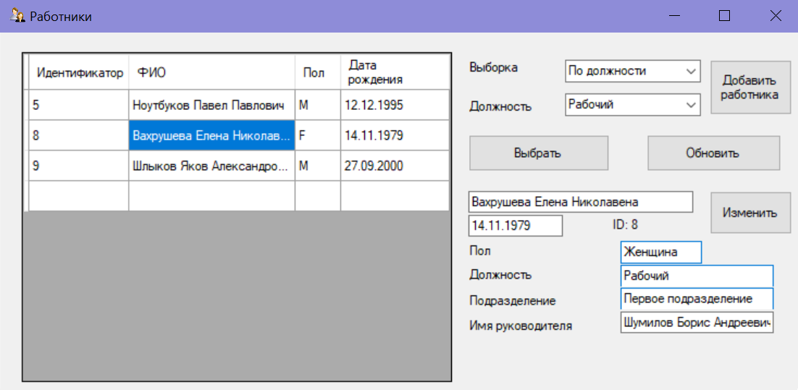
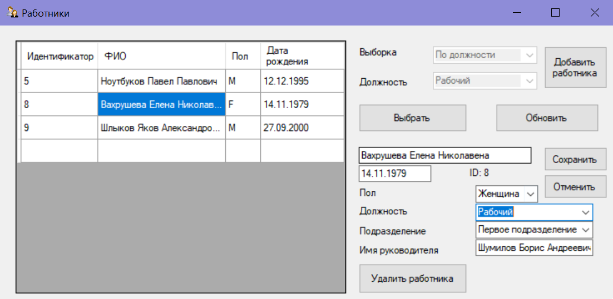
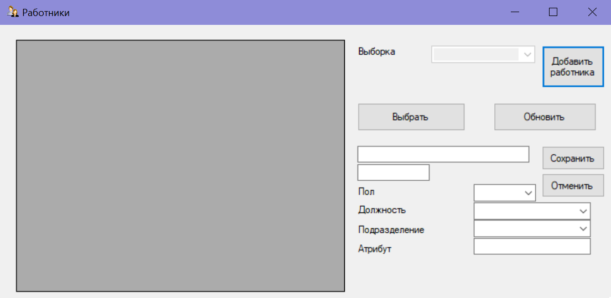

# Employees
Программа, предназначеная для учета персонала на предприятии.
Данная программа использует базу данных SQLite для хранения работников пердприятия. Пользовательский интерфейс выполнен с помощью Windows Forms.

 

***

## Выборки работников

    Создавать выборки работников можно с помощью выпадающих меню. 
    В программе предусмотрены следующие выюорки:
    - Все работники
    - Выбока работников по занимаемой должности
    - Выборка работников по подразделению, в которм они работают

***

## Информация о работнике

    Для получения полной информации о работнике необходимо кликнуть по соответсвующей строке в таблице и на экране появятся новые поля и кнопки.

***
## Редактирования работника

    Для редактирования инормации о работнике нужно кликнуть по кнопке "Изменить" и тогда поля станут доступны для редактирования. Чтобы отправить изменения в базу данных необходимо нажать на кнопку сохранить, а после нажать на кнопку обновить, для отображения в таблице актуальной информации. 

***
## Добавление нового работника

    Для добавления нового работника нужно кликнуть на кнопку "Добавить работника" и тогда на экране появятся поля для заполнения информации.

***
